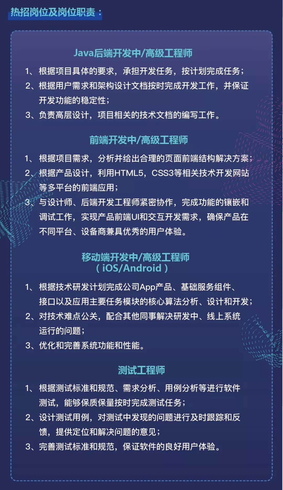

# 2019年7月13日顺丰社招信息

# 社招面试一般流程

技术面3轮 :
第一轮：小组负责人
第二轮：系统负责人
第三轮：总监面
最后hr面

# 公司简介
* 公司福利：[公司福利](http://www.sf-tech.com.cn/corporatewelfare)
* 员工活动：[员工活动](http://www.sf-tech.com.cn/employeeactivity)
* 办公环境：[办公环境](http://www.sf-tech.com.cn/officeenvi)
